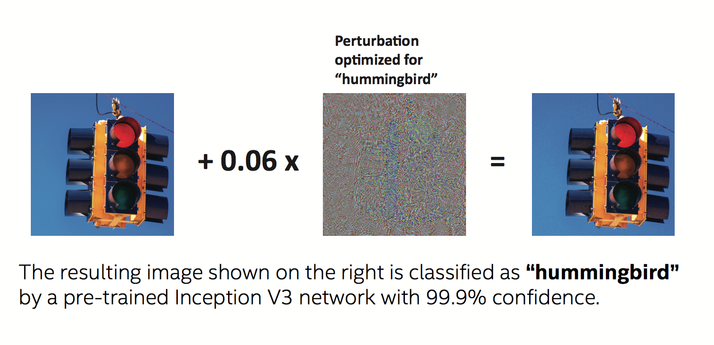

# Adversarial attacks and defenses - NIPS 2017

This repository contains source code for the following competitions:

* [NIPS 2017: Non-targeted Adversarial Attack](https://www.kaggle.com/c/nips-2017-non-targeted-adversarial-attack)
* [NIPS 2017: Targeted Adversarial Attack](https://www.kaggle.com/c/nips-2017-targeted-adversarial-attack)
* [NIPS 2017: Defense Against Adversarial Attack](https://www.kaggle.com/c/nips-2017-defense-against-adversarial-attack)

| Directory | Description                                                                   |
|-----------|-------------------------------------------------------------------------------|
|[mmnta](mmnta)   | Non-targeted Adversarial Attack
|[mmta](mmta)     | Targeted Adversarial Attack
|[mmd](mmd)       | Defense Against Adversarial Attack
|[poster](poster) | Workshop posters
